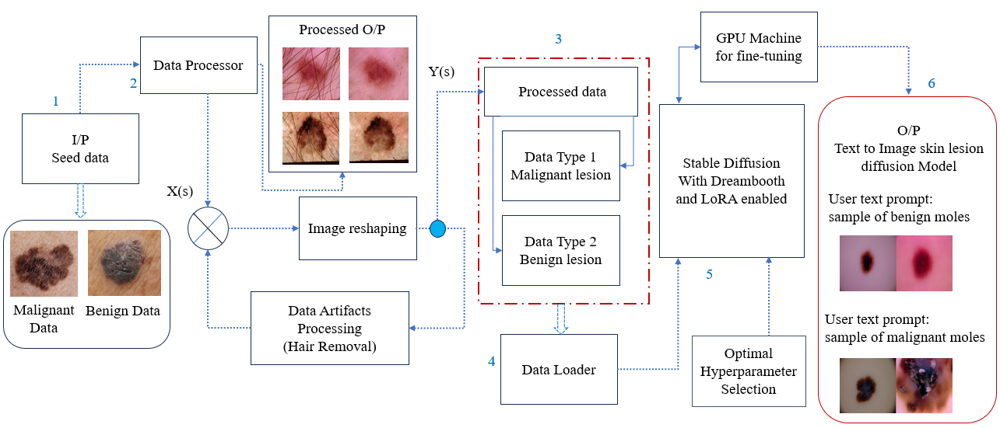

# Derm-T2IM: Harnessing Synthetic Skin Lesion Data via Stable Diffusion Models

This repo contains all the codes. trained models, Newly generated synthetic skin lesion dataset using dreambooth and LoRA tools

The complete novel synthetic datset can be downloaded from provided google drive link.
https://github.com/ultralytics/yolov5 

The  trained model can be downloaded from our hugging face space.
Link: https://ieee-dataport.org/documents/c3i-thermal-automotive-dataset

1. The complete block diagram represetation along with working methodology of the proposed system is as follows.

Link: https://nuigalwayie-my.sharepoint.com/:f:/g/personal/m_farooq3_nuigalway_ie/EmSY4MawO89Kt_6wsDn_V1YBzeuwLYe6z2b2VU2WJp0b3g?e=wb8IgU

2. The trained models using all the three optimizers SGD, ADAM and ADAMW can be found in the following link. The link also provided optimized version of the model using TensorFlowLite tool in the SGD model folder.

Link: https://nuigalwayie-my.sharepoint.com/:f:/g/personal/m_farooq3_nuigalway_ie/EoomnUQ1xxNKqPDfCJgtQMsBnGiEaKtUsj8zUMc71EPnhQ?e=vlpjGT 

3. The overall validation/ testing results using different confidence threshold and IoU threshold can be found in the following link.

Link: https://nuigalwayie-my.sharepoint.com/:f:/g/personal/m_farooq3_nuigalway_ie/ErYzIbafONlKl04jTAnpFQkBEK9-B2N350DWgSnk8rIGLw?e=lknp0f

The complete synthetic dataset comprising of 3K benign and 3K malignant samples can be downloaded from the below link.

The dataset samples can be download from the below link

The model can be downloaded from our hugging face page
