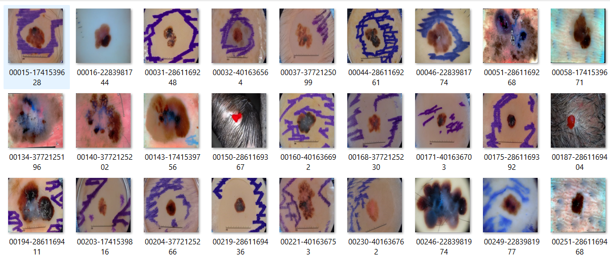

# Derm-T2IM: Harnessing Synthetic Skin Lesion Data via Stable Diffusion Models
This repo contains all the codes. trained models, Newly generated synthetic skin lesion dataset using dreambooth and LoRA tools. The model was tuned by employing Dreambooth and LoRA tool. 

Link: https://dreambooth.github.io/

%Dreambooth Enviroment setup on Colab (under construction): https://colab.research.google.com/drive/1ZfgMO_ucKrPYyjhkISJRpNi0Cir-1VP_#scrollTo=A4Bae3VP6UsE

**The work is submitted in IEEE EMBC 2024 conference.**

### The complete block diagram represetation along with working methodology of the proposed system is as follows.

### The below figure show the samples images of benign and malignant data.

### The below figure shows smart transformation results which includes tiny benign moles, multiple moles on skin region, and large malignant moles.

### The rendered data was cleaned out by discarding all the noisy samples as demonstrated below.

### The model was trained for 120 epoch by selecting follwing set of model hyperparametrs and with average 5.3 GB of VRAM usage.

### The Derm-T2IM dataset in combination with real-world datasets shows robust results during the validation phase of CNN and ViT pretrained models.

1. The complete synthetic dataset comprising of 3K benign and 3K malignant samples can be downloaded from the below google-drive link.

Link: https://huggingface.co/datasets/MAli-Farooq/Derm-T2IM-Dataset

2. The sample dataset can be downloaded from our github page sample dataset folder

Link: https://github.com/MAli-Farooq/Derm-T2IM/tree/main/sample%20dataset

4. Smart transformation data generated via DERM-T2IM can be downloaded from the below link.

Link: https://huggingface.co/datasets/MAli-Farooq/Derm-T2IM-Dataset

4. The  trained/ tuned model can be downloaded from our hugging face space.

Link: https://huggingface.co/MAli-Farooq/Derm-T2IM

5. The complete study can be accessed via open archive link.

Link: https://arxiv.org/abs/2401.05159

